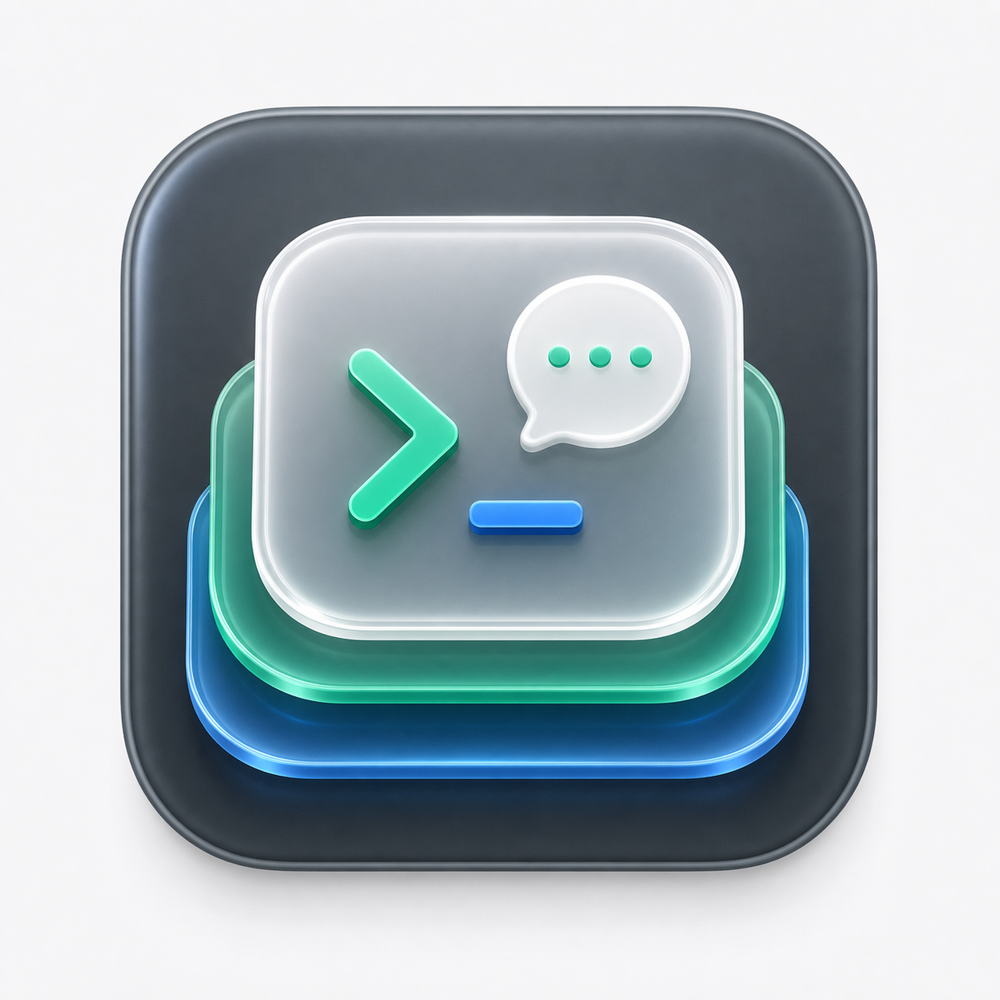

# codexStack



codexStack is a native macOS menu bar app for managing local Codex sessions.

## What It Does

- Groups sessions by project with collapsible hierarchy
- Supports Active/Archived scopes and text search
- Shows session metadata in a dedicated manager pane
- Opens conversation preview in a separate modal
- Supports whole-project removal by moving project sessions to Trash
- Archives, unarchives, renames, and moves sessions to Trash
- Reconciles `session_index.jsonl` after mutations
- Reads Codex session titles from `state_5.sqlite`
- Shows session/weekly subscription utilization
- Shows cost estimation for today and last 30 days
- Provides a menu bar Settings window for display options and Codex root directory

## Data Sources

- `~/.codex/state_5.sqlite`
- `~/.codex/sessions`
- `~/.codex/archived_sessions`
- `~/.codex/session_index.jsonl`

Default root path is `~/.codex`, configurable in `Settings...` from the menu bar.

## Run Locally

```bash
swift run codexStack
```

## Build

```bash
swift build
```

The repository also includes a standard Xcode macOS app project:

```bash
xcodebuild -project codexStack.xcodeproj -scheme codexStack -configuration Debug build
```


## Acknowledgements

- Inspired by and partially informed by implementation patterns from
  [steipete/CodexBar](https://github.com/steipete/CodexBar), especially around
  Codex usage parsing, cost history aggregation, status item icon rendering, and
  hover-detail chart UX.
